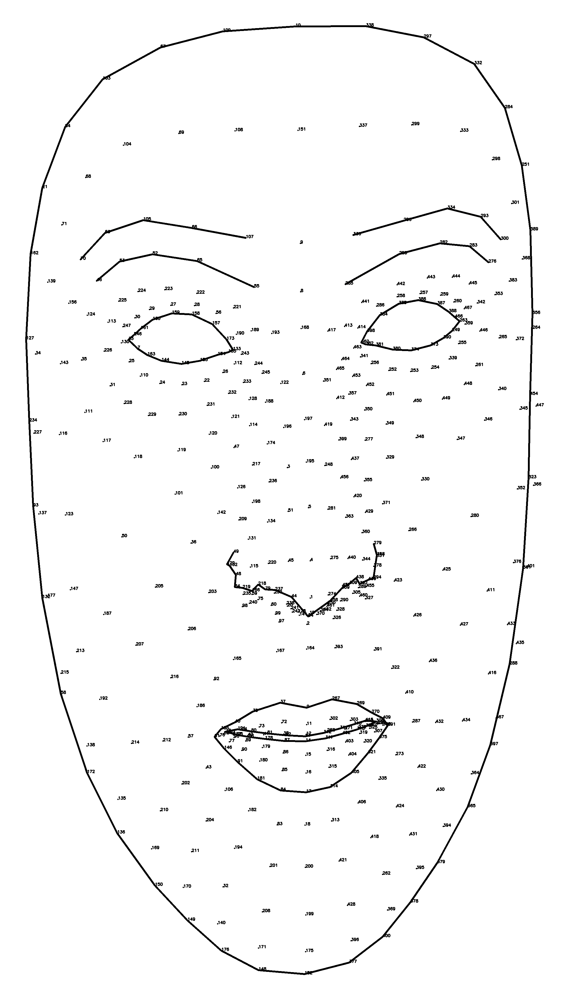

# Media pipe Face landmarks
I was using the mediapipe library to extract facial landmarks from images. But when I needed to process the output, It was very difficult to find on the internet which landmark corresponds to what point on the face.

So I built a little software to extract those landmarks and then plot them in a white image where you can find the id of each landmark. that's useful if you want to use a subset of these landmarks.

The file mp_face_landmarks.png is a high resolution image with numbers for each landmark. You can simply zoom in it and get all the landmarks you want.

A version with some connections

